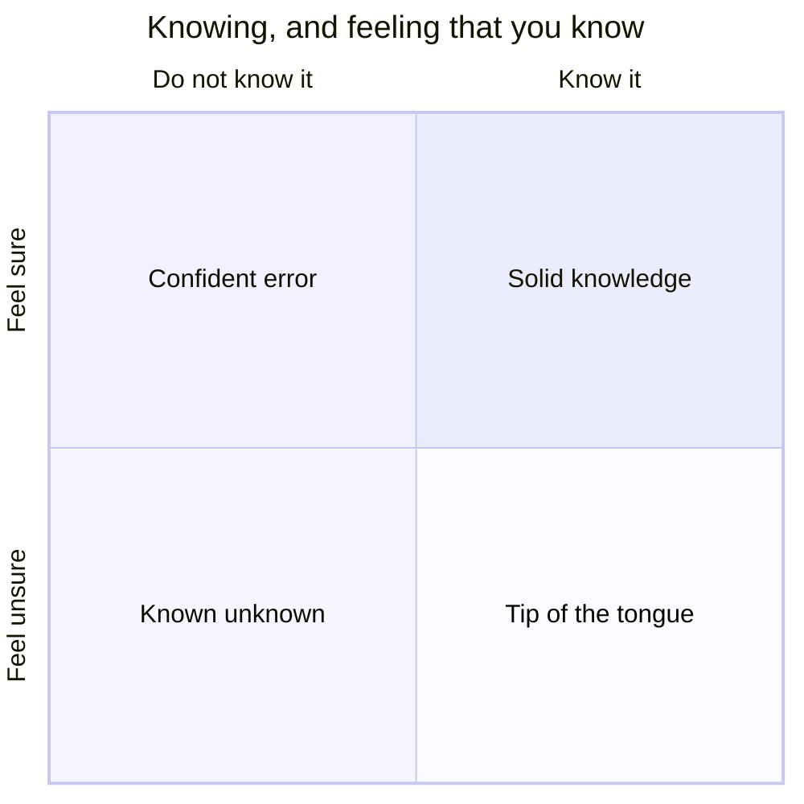
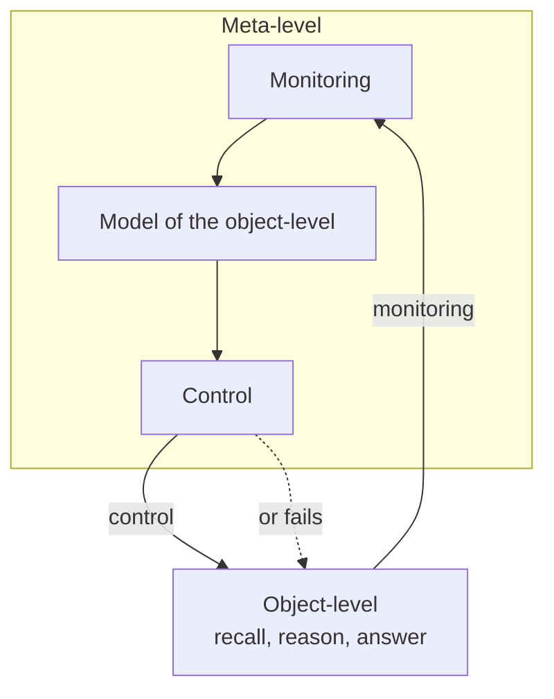

I spend a lot of my time on one question: do language models know what they know? Can a model tell the difference between a fact it holds and a guess it is about to make? It is a practical question with real consequences, and I promise the machines are coming. But the longer I sat with it, the more it hid a harder question underneath. Before you can ask whether a machine knows what it knows, you have to say what that even means. What is actually happening when you, a person, feel sure you know something?

This post is about that. The human version, on its own terms. The machines come in Part 2.

## Thinking about thinking

The word for it is metacognition. The psychologist John Flavell formalised it in a 1979 paper, defining it, roughly, as knowledge about your own knowing. His full phrasing, "knowledge and cognition about cognitive phenomena", is broader, but the part we need is the reflexive core: thought turned back on your own thought.

The move is worth slowing down on, because it is stranger than it sounds. There is the thing you know, that Paris is the capital of France. And there is a second, separate thing: your knowledge that you know it. Those are different objects. The first is a fact about the world. The second is a fact about you. And they can come apart, in both directions.

They are independent axes: whether you actually know the thing, and whether you feel that you do. When they agree you are on the diagonal, solid knowledge in one corner and honest ignorance in the other. When they come apart you get the two failures the chart names, and the top-left one, confident error, is the dangerous one. Metacognition is the work of staying on the diagonal, and this whole post is about how easily we slip off it.

## The architecture: monitoring and control

The most useful map anyone has drawn of this layer came from Thomas Nelson and Louis Narens in 1990, and it is worth reproducing, because most of the confusion around the topic clears up once you can see it.

They split the mind into two levels. The **object-level** does the actual work: recalling the capital of France, adding two numbers, parsing this sentence. It is where thinking happens. It does not comment on itself, it just runs.

The **meta-level** sits one step back and keeps a running picture of how the object-level is doing. It is not solving the problem. It is watching the solving and forming an opinion about it: this is going well, I am stuck, I am not sure. If the object-level is a worker, the meta-level is the supervisor who never touches the task but always has a read on how it is going. In their framework that running picture has a name, a **model** of the object-level, and it is the hub everything else plugs into.

Two things flow between the levels. **Monitoring** is the upward flow, from worker to supervisor: the meta-level reads the state of the thinking below and updates its model, turning it into a judgment, I know this, I half-know this, I am guessing. **Control** is the downward flow, from supervisor to worker: the meta-level acts on that model, keep going, slow down, check that, stop and admit you do not know.

That is the machine as they drew it, and the drawing is theirs, not mine. The meta-level holds a model of the object-level. Monitoring updates that model from below, and control acts on the object-level from above. What travels up the monitoring channel are judgments with names in the research: the feeling of knowing, the judgment of learning, the plain confidence you attach to an answer the moment after you give it. What travels down the control channel are the actions you take in response: keep going, slow down, check, hedge, or admit you do not know.

Here is the point I would carry out of the whole post, and it is my gloss, not theirs: monitoring without control is useless. A flawless sense of your own uncertainty is worth nothing if it never changes what you do. Picture the two ways it can break. Someone who monitors badly but acts on what little they sense will at least hesitate in roughly the right places. Someone who monitors perfectly but never acts on it is worse than they look: the doubt is there, the supervisor is plainly signalling "you are not sure", and the worker answers at full confidence anyway. The signal never reached the steering.

This also makes the failures genuinely hard to tell apart from the outside. A confident wrong answer, on its own, could be any of three things: a plain gap in knowledge, a monitoring failure where the doubt was never sensed, or a control failure where the doubt was sensed and ignored. You cannot call it a metacognitive failure at all unless you can show the knowledge was there and went unused. Otherwise it is just ignorance wearing a confident face. Pulling those apart is most of the difficulty in studying this, in people and, as Part 2 will show, in machines.

## The twist

A system that genuinely knew what it knew would need two things from that monitoring signal. Sensitivity: its confidence has to separate right from wrong at all, running higher when it is correct and lower when it is not. And calibration: the numbers have to mean what they say, so that "ninety percent sure" turns out right about ninety percent of the time. The two get blurred together constantly, but they are different properties, and a system can have one without the other. You might assume the human mind delivers both by looking its knowledge up. Here is the uncomfortable part. It does not look anything up.

That upward signal, monitoring, the meta-level's read on the worker, does not behave like a readout of an internal registry. There is no flag to check. It behaves more like an inference, assembled on the spot from indirect cues: how familiar the question feels, how quickly something starts to come back, how fluently the first fragments arrive, the half-remembered shape of a name with the sense that the rest is just behind it. The brain reads those cues and calls the result a feeling of knowing.

Most of the time this works, and it is worth seeing why. The cues are normally trustworthy. A thing you genuinely know tends to feel familiar precisely because you have actually met it before, so familiarity is a fair stand-in for knowledge. The system is not being lazy, it is being efficient: it reads a reliable proxy instead of attempting a lookup it cannot do.

The catch is that the proxy and the knowledge can be pried apart, and then the same machinery misfires. Familiarity can attach to the question rather than the answer. When a problem is full of terms you recognise, in a domain you have seen before, the feeling of knowing the answer rises even when you cannot actually retrieve it (Koriat and Levy-Sadot, 2001). The brain cannot cleanly tell "this feels familiar because I know the answer" from "this feels familiar because I recognise the question". The signal that is meant to report "this is in my memory" fires on mere familiarity. We are not reading our competence off a gauge. We are estimating it from surface cues, and the estimate is frequently wrong.

So the gold standard for knowing what you know, the human mind, the thing we hold machines up against, turns out not to know what it knows in the clean way the phrase implies. It makes a fast, cue-based guess about its own contents, and is often mistaken about them.

It is worth turning that back on this post. Everything here, the two levels, the model in the middle, the cues, is itself a model, drawn by the same kind of guessing mind it describes. Nelson and Narens gave us a map, not the territory. Koriat gave us an inference about inference. Some of it is firmly measured and the rest is the best picture we have, which is to say the best guess we have. We are using the instrument to inspect itself.

Knowing what you know is itself a guess.

Part 2 asks what that guess looks like inside a machine.

## References and further reading

- Flavell, J. H. (1979). [Metacognition and cognitive monitoring: A new area of cognitive-developmental inquiry](https://doi.org/10.1037/0003-066X.34.10.906). *American Psychologist*, 34(10), 906 to 911.
- Nelson, T. O., and Narens, L. (1990). [Metamemory: A theoretical framework and new findings](https://doi.org/10.1016/S0079-7421%2808%2960053-5). *The Psychology of Learning and Motivation*, 26, 125 to 173. ([open PDF](https://sites.socsci.uci.edu/~lnarens/1990/Nelson&Narens_Book_Chapter_1990.pdf))
- Koriat, A. (1993). [How do we know that we know? The accessibility model of the feeling of knowing](https://doi.org/10.1037/0033-295X.100.4.609). *Psychological Review*, 100(4), 609 to 639. ([open PDF](https://iipdm.haifa.ac.il/images/publications/Asher_Koriat/1993-Koriat-PR%20FOK.pdf))
- Koriat, A., and Levy-Sadot, R. (2001). [The combined contributions of the cue-familiarity and accessibility heuristics to feelings of knowing](https://doi.org/10.1037/0278-7393.27.1.34). *Journal of Experimental Psychology: Learning, Memory, and Cognition*, 27(1), 34 to 53. ([open PDF](https://iipdm.haifa.ac.il/images/publications/Asher_Koriat/2001-KorLevySadot-JEPLMC.pdf))
- Fleming, S. M., and Lau, H. C. (2014). [How to measure metacognition](https://doi.org/10.3389/fnhum.2014.00443). *Frontiers in Human Neuroscience*, 8, 443. ([open access](https://www.frontiersin.org/articles/10.3389/fnhum.2014.00443/pdf))
