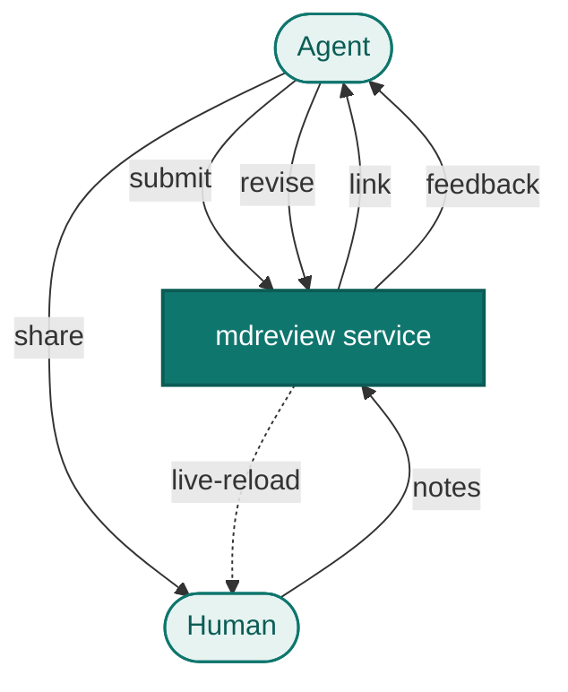

Most of what I ship now starts as a draft a coding agent wrote from a spec I gave it: a planning doc for a project, a proposal, a blog post, a design note. The agent is good at the first pass, but the first pass has a failure mode: it comes out averaged. It reads like the middle of everything the model has seen, smoothed and confident and quietly not what I meant. Lean on it too hard and you can watch your own voice and direction drain out of the work, one accepted sentence at a time, until the thing is something the model decided rather than something you did.

So the real work is not the drafting, it is the feedback loop. I read what the agent produced, I find the sentences that are soft or off or just not mine, and I push it back toward what I actually think. That loop is how I keep my hands on the work instead of handing the wheel to a model, and for a long time it was the clunkiest part of my day.

The problem is location. When I give feedback in chat, or in the terminal of a coding agent, I lose where each comment belongs. "The third paragraph, second sentence, the part about latency, that claim is too strong" is a sentence I have typed more times than I want to admit. It does not scale. By the time the draft has fifteen notes, half of them are about places that have already moved because the agent edited around them. The revisions are not traceable, and the thing I actually meant gets lost somewhere in the back and forth. I wanted to point at the actual words and have the note stick to those words.

## The first version was a CLI

So I built a small thing called `mdreview`. Point it at a markdown file and it opens a clean reading view in the browser. You select text to attach a note to those exact words, or you click a paragraph number in the left margin to comment on the whole block. Every note streams to a `<name>.feedback.md` file next to the source, in a format the agent can read and act on. When the agent applies an edit and rewrites the file, the page live-reloads and strikes through the notes it addressed.

That worked well enough that I used it every day, and using it every day is how I found its limits. It is one process per file. It binds to localhost and auto-picks a port, so each review is its own little server. The feedback lands on the local filesystem, which means the thing reading it has to be on the same machine. None of that matters when I am reviewing one file by hand. It all matters the moment I have three drafts open at once, or an agent running somewhere that is not my laptop, or two agents that both want to hand me something to look at. I was juggling ports and processes to do one simple thing.

## The rebuild: one service, many sessions

The fix was to stop thinking of it as a command and start thinking of it as a service. `mdreview-service` is a single running container. An agent POSTs markdown to it and gets back a review URL. Each review is an isolated session keyed by an opaque id, so any number of agents and any number of drafts run through the same instance at once without colliding. No port juggling, no shared filesystem, no process per file. The agent does not care where the service runs, and it does not even have to speak HTTP.

## The interface is MCP

Almost every agent I run speaks MCP, so that is the interface I built for. The service ships with a thin MCP server that exposes the whole thing as eight tools, one per operation:

- `create_review` submit a draft, get back a review URL and id
- `get_status` cheap poll of the source and feedback timestamps
- `get_feedback` the human's notes, structured and as a rendered block
- `update_source` push a revised draft (live-reloads, snapshots a history round)
- `get_history` recover a past round's draft and the feedback it got
- `list_reviews` every review and its status
- `get_review` one review's metadata
- `delete_review` remove a review

Wire it into an agent once, and asking a human for a review stops being a special integration. It becomes a capability the agent already knows how to call, the same way it calls a search or a file read.

In practice the loop is four of those calls: the agent creates a review and hands me the link, polls `get_status` and reads `get_feedback` while I annotate, then pushes the result with `update_source`. Each note it gets back carries the block number, the exact quoted selection, my comment, and an `addressed` flag, so it knows precisely where every fix belongs. The moment `update_source` lands, my open page reloads to the new draft and the notes it handled strike through in front of me. I can see which comments it actually addressed and which it skipped, then read the new version and go around again.

Under those tools is a plain HTTP service, and the MCP server is a stateless wrapper over it, so an agent that does not speak MCP can call the same endpoints (`POST /api/reviews`, `GET /api/reviews/{id}/feedback`, `PUT /api/reviews/{id}/source`) directly. But MCP is the positioning: a portable, drop-in "hand the human the pen" tool that any MCP agent, anywhere, can pick up.



Every PUT also snapshots a history round: the outgoing draft plus the feedback it accumulated get archived under a numbered round before the new source overwrites the old. So an earlier version and the notes it received are always recoverable, not just the latest state. When I want to see how a paragraph got to where it is, the history is right there behind a button in the viewer.

## The design choices, and why

A few decisions are worth calling out, because they are the reason the tool is pleasant to live with rather than another service I have to babysit.

**Stdlib Python only.** The whole server is `http.server` and the standard library. There is no `pip install`, no dependency tree, no lockfile to keep current. The image is `python:3.12-slim` and a handful of files. It builds fast and it is small, and there is almost nothing in it that can rot.

**Self-contained in the browser too.** The markdown renderer and the diagram renderer are vendored and served from the container's own `/static`. The viewer needs no CDN, which means it works on a locked-down network and will keep working when some external script host changes its API or disappears.

**The MCP server adds no state.** It is stdlib only and holds nothing of its own; it just translates tool calls into requests against a running instance. So the safety properties and the storage all live in one place, the HTTP service, and the MCP layer cannot drift from it.

## How I actually use it

This is now how I review the things my agents write, including this post. The draft you are reading went through it: an agent created the review, I marked up the words I did not like, and it called `update_source` over MCP each time it worked off a note, while I watched my comments strike through one by one. Because it is one shared service rather than a process I spawn per file, several drafts can be in flight at once, and an agent does not have to be on my machine to ask me for a read.

It is built for trusted, local use. There is no auth: the dashboard and the review list show every review to anyone who can reach the port. That is fine on a laptop or a private network and a bad idea on the open internet, so if you expose it, put a reverse proxy with a token in front. Within that scope it does exactly one job and gets out of the way.

The code is on GitHub: [waqaskhan137/mdreview-service](https://github.com/waqaskhan137/mdreview-service). Running it is one line:

```bash
docker compose up -d --build   # serves on http://localhost:8137
```

Then point an agent at the MCP server by adding it to the agent's config:

```json
{
  "mcpServers": {
    "mdreview": {
      "command": "python3",
      "args": ["/path/to/mdreview-service/mcp_server.py"],
      "env": { "MDREVIEW_BASE": "http://localhost:8137" }
    }
  }
}
```

That is the entire setup. From then on the agent has a `create_review` tool, and I have a browser tab where its drafts show up for me to mark. The interesting part was never the server. It was getting the feedback to stick to the words, and then handing the agent a tool so it could do the rest itself.
